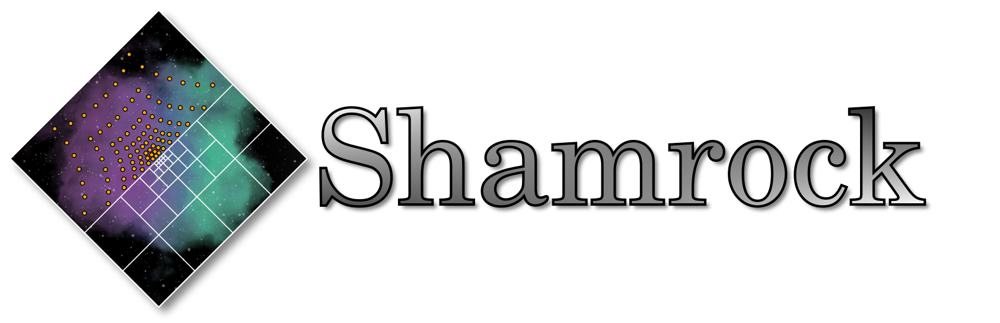

 [](https://github.com/pre-commit/pre-commit)

# The Shamrock code

Shamrock is a general purpose HPC hydrodynamics simulation code focused on astrophysical contexts.
The whole code is **C++17** by default, and all accelerated parts are done using **SYCL**,
which can be directly compiled directly to native **CUDA**, **ROCM**, **OpenMP**, **OpenCL** and much more.
Shamrock also supports multiple GPUs and Heterogeneous clusters using **MPI**.

This code aims to be **Modern**, **Modular**, **Fast**, **Portable**.

## Packaging

[](https://repology.org/project/shamrock/versions)

### Third-party :

- Shamrock docker : `docker run -it --platform=linux/amd64 ghcr.io/shamrock-code/shamrock:latest-oneapi`

## Citing the code

[](./CITATION.bib)
[](https://ui.adsabs.harvard.edu/abs/2025MNRAS.539....1D)
[](https://arxiv.org/abs/2503.09713)

# Documentation

We provide both a book like documentation and the more classic doxygen style for more details about the sources
 - The documentation is available here: [Shamrock documentation](https://shamrock-code.github.io/Shamrock/mkdocs/index.html)

# Getting started

The whole getting started guide can be found here: [Getting started](https://shamrock-code.github.io/Shamrock/mkdocs/usermanual/quickstart/)

Note that a convenient way to pull the Shamrock repo is the following command to also pull the submodules:
```bash
git clone --recurse-submodules https://github.com/Shamrock-code/Shamrock.git
```

## Getting in touch

Join us on [Discord](https://discord.gg/Q69s5buyr5), or [Slack](https://shamrock-code.slack.com)! Alternatively, open a discussion or issue in this repository.

## Contributing

Shamrock accept contributions through github pull request :
1. Code contributions via [Pull request](https://github.com/Shamrock-code/Shamrock/compare)
2. Documentation contributions via [Pull request](https://github.com/Shamrock-code/Shamrock/compare)
3. Issue report & feature requests via [Github issues](https://github.com/Shamrock-code/Shamrock/issues/new/choose)

If you want to contribute please fork the code and submit your pull requests from your fork.

## Compiler support

Compiler config | Support
---|---
DPC++ CUDA | 
DPC++ ROCM | 
AdaptiveCPP OpenMP | 
AdaptiveCPP ROCM | 
AdaptiveCPP CUDA | 
AdaptiveCPP SSCP | 

# Licensing

Shamrock is licensed under the `CeCILL Free Software License Agreement v2.1`. See [License (french version)](./LICENSE) or [License (english version)](./LICENSE.en) for more details.

Copyright 2021-2025 Timothée David--Cléris

SPDX-License-Identifier: CeCILL Free Software License Agreement v2.1
