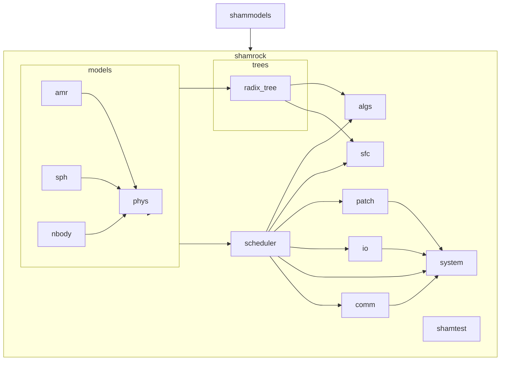

# Modules in SHAMROCK

every module must have bindings and be tested using `shamtest` (tests are in file located in `*module*/test` )

structure of a module must be : 

```markdown
*module*
├── ...
├── bindings
└── tests
```
# List of modules
```markdown
--- shamsys ---

--- shamtest ---

--- shamrock ---
patch
scheduler
comm
io
algs
space filling curves (sfc)
trees
└── radix_tree
amr
sph
nbody
phys

--- shammodels ---
amr
sph
nbody
```

- `system` provide a `ShamrockInstance` that basically wrap mpi & sycl context
- `scheduler` provide a `PatchScheduler`, multiples scheduler can exist
- `phys` only add model definition and bindings but adds no mains

in `shammodels` we only put implementations of actual physical models, every utility **must** be in the core module (`shamrock`). For ex. the fmm module will be in `shamrock/nbody` but the physical integrator will be instantiated in `shammodels/nbody`, and the integrator template should be in `shamrock`


# Directory structure

 ```markdown
--- root dir ---
buildbot
doc
external
├── *libs (git submodules)*
└── CMakeLists.txt
src
├── shamsys
│   ├── *sources*
│   └── CMakeLists.txt
├── shamtest
│   ├── *sources*
│   └── CMakeLists.txt
├── shamrock
│   ├── *sources*
│   └── CMakeLists.txt
├── shammodels
│   ├── *sources*
│   └── CMakeLists.txt
└── CMakeLists.txt
CMakeLists.txt
```

`src` is added to the include path to be able to do 
```cpp
#include "shamrock/legacy/scheduler/scheduler.hpp"
```

allow for a better separation of the documentation/ source code/ utilities

# Namespaces

`shamrock` => `shamrock::`
`shammodels` => `shammodels::`

in general the namespace should be `*component*/*module*/...`

# Experimental features

Should be implemented in the proper place but each line of codes of an experimental feature should have an include guard like :

```cpp
#ifdef SHAMROCK_EXPERIMENTAL

#include ....

/// code ///

#endif
```
in general the namespace should be `*component*/*module*/experimental/...`
the file must be located in the wanted folder / experimental 

# Legacy features

in general the namespace should be `*component*/*module*/legacy/...`
the file must be located in the wanted folder / experimental 

# Core module interactions



# CMake Usage

in each module the cmake usage should be :

```cmake
set(Sources
    ... .cpp = list of source files
)
set(SourcesTest
    ... .cpp = list of sources files for test
)
set(Headers
    ... .hpp = list of source files
)
set(HeadersTest
    ... .hpp = list of sources files for test
)

target_sources(shamrock
    PRIVATE
        ${Sources}
    PUBLIC
        ${Headers}
    )

if("${BUILD_TEST}")
target_sources(shamrock_test
    PRIVATE
        ${Sources} ${SourcesTest}
    PUBLIC
        ${Headers} ${HeadersTest}
    )
endif()

```

# Module description 

## System

 - `SyclHelper`
 - `MpiHelper`
 - `NodeInstance`