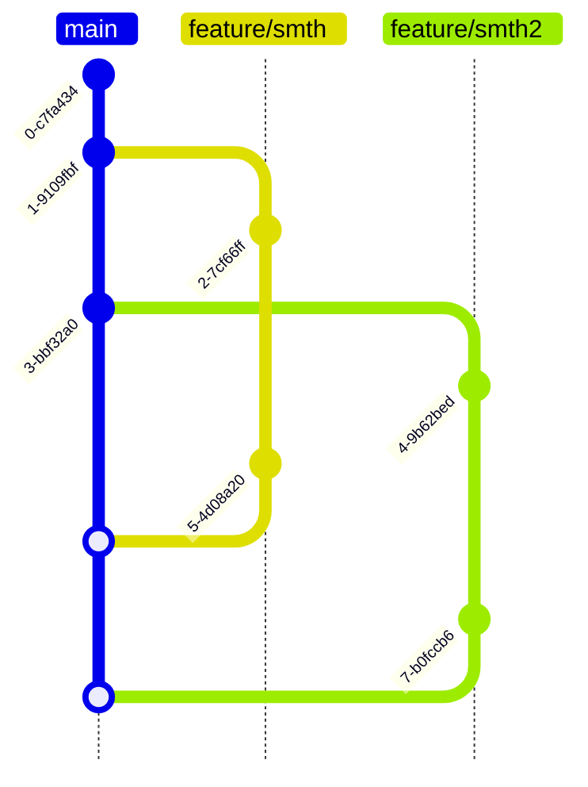
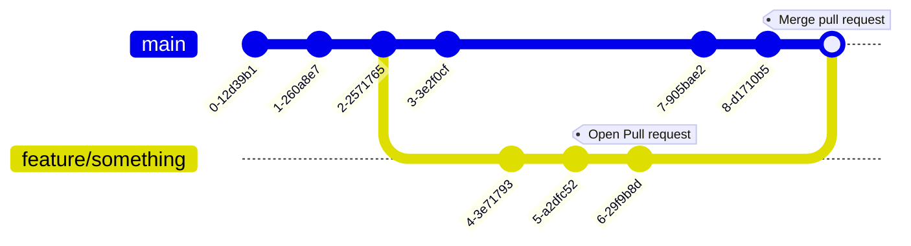

# Git guide

## What is git
**TODO**

### Structure of a git project


### Submodules

**TODO**


## Usage of git in shamrock 

Resemble to gitflow: 



Open a branch called, `feature/...`, `doc/...`, whatever as long as it's clear. Do your changes, and then open a pull request.

## Cloning a repository

To clone a repository and its submodules
```bash
git clone --recurse-submodules git@github.com:tdavidcl/Shamrock.git
```

## Git configuration

Username and mail : 
```bash
git config --global user.name "<github username>"
git config --global user.email "<github email>"
```

Default editor : 

=== "Nano users"

    ```bash
    git config --global core.editor nano
    ```

=== "Vim users"

    ```bash
    git config --global core.editor vim
    ```

## Making a commit 
First go on the branch your are working on :
```bash
git fetch --all
git checkout <branch name>
```

Do your changes then :

```bash
git add <files that were modified>
git commit -m "my commit message"
git push
```

For the commit message please name them accordingly : 
`[<Modified component>] <the commit message>`, for exemple `[SPH] fix ....`