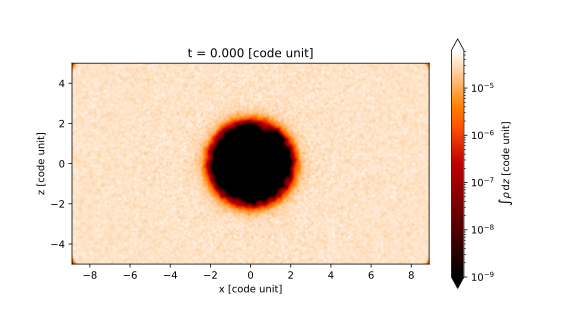
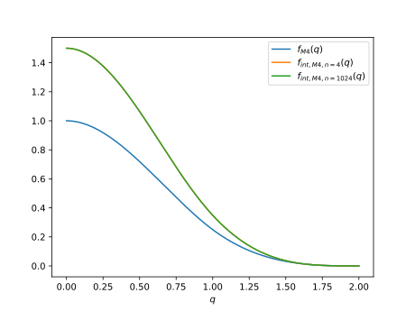
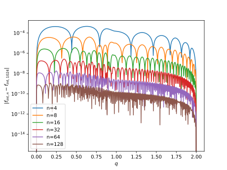

# Plotting results

## Rendering
In SPH we have access to rendering, it can be used in runscripts as follows :

First define the parameters of the plot
```py
pixel_x = 1920
pixel_y = 1080
radius = 5
center = (0.,0.,0.)

aspect = pixel_x/pixel_y
pic_range = [-radius*aspect, radius*aspect, -radius, radius]
delta_x = (radius*2*aspect,0.,0.)
delta_y = (0.,radius*2,0.)
```

You can do a column integrated plot :
```py
arr_rho = model.render_cartesian_column_integ(
    "rho",
    "f64",
    center = (0.,0.,0.),
    delta_x = delta_x,
    delta_y = delta_y,
    nx = pixel_x,
    ny = pixel_y)
```

Or a slice :
```py
arr_rho = model.render_cartesian_slice(
    "rho",
    "f64",
    center = (0.,0.,0.),
    delta_x = delta_x,
    delta_y = delta_y,
    nx = pixel_x,
    ny = pixel_y)
```
Note here that you can save the obtained numpy array using `np.save` and recover it using `np.load`

## Matplotlib
You can then either do a standard plot like so :
```py
import copy, matplotlib
my_cmap = copy.copy(matplotlib.colormaps.get_cmap('gist_heat')) # copy the default cmap
my_cmap.set_bad(color="black")

plt.figure(figsize=(16/2,9/2))
res = plt.imshow(arr_rho, cmap=my_cmap,origin='lower', extent=pic_range, norm="log",vmin=1e-9)

cbar = plt.colorbar(res, extend='both')
cbar.set_label(r"$\int \rho \, \mathrm{d} z$ [code unit]")
# or r"$\rho$ [code unit]" for slices

plt.title("t = {:0.3f} [code unit]".format(model.get_time()))
plt.xlabel("x")
plt.ylabel("z")
```

This should result in something like this :


Or you do the same plot using the splash cinematic way like so :
```py
import copy, matplotlib
my_cmap = copy.copy(matplotlib.colormaps.get_cmap('gist_heat')) # copy the default cmap
my_cmap.set_bad(color="black")

dpi=200
plt.figure(dpi=dpi)
plt.gca().set_position((0, 0, 1, 1))
plt.gcf().set_size_inches(pixel_x / dpi, pixel_y / dpi)
plt.axis('off')

res = plt.imshow(arr_rho, cmap=my_cmap,origin='lower', extent=pic_range, norm="log",vmin=1e-9)

axins = plt.gca().inset_axes([0.73, 0.1, 0.25, 0.025])
cbar = plt.colorbar(res,cax=axins,orientation="horizontal", extend='both')
cbar.set_label(r"$\int \rho \, \mathrm{d} z$ [code unit]")

from matplotlib.offsetbox import AnchoredText
anchored_text = AnchoredText("t = {:0.3f} [code unit]".format(model.get_time()), loc=2)
plt.gca().add_artist(anchored_text)
```


## Adding sink particles

You can also add sink particles to the plot like so
```py
output_list = []
for s in model.get_sinks():
    x,y,z = s["pos"]
    output_list.append(
        plt.Circle((x, z), s["accretion_radius"], color="chartreuse", fill=False))
for circle in output_list:
    plt.gca().add_artist(circle)
```


## Details of the rendering function
In this sample the core function to be used is `model.render_cartesian_slice` which will
render the slice using the GPU trees. It will return a numpy array with the slice.


The arguments to be passed to the function are :

- `field name`: the field name to render
- `field_type`: the type of the data to be rendered
- `center`: the center of the slice
- `delta_x` and `delta_y`: the size of the slice
- `nx` and `ny`: the number of pixels in the slice


## Column density algorithm

The standard SPH kernel is defined as being

\[
    W(\mathbf{r},h) = \frac{C_{norm}}{h^3} f\left(q = \vert \frac{\mathbf{r}}{h}\vert \right)
\]

If we integrate along the z axis we can define a new kernel

\[
    Y(x,y,h) = \frac{C_{norm}}{h^3} \int \mathrm{d}z \, f\left(q = \vert \frac{\mathbf{r}}{h}\vert \right)
\]

Which can can transform as follows

\[
    Y(x,y,h) = \frac{C_{norm}}{h^2} \int \mathrm{d}q_z \, f\left(\sqrt{q_x^2 + q_y^2 + q_z^2}\right) = \frac{C_{norm}}{h^2}  g\left(\sqrt{q_x^2 + q_y^2 }\right)
\]

where

\[
    g(q_x) = \int \mathrm{d}q_z \, f\left(\sqrt{q_x^2  + q_z^2}\right)
\]

We can use a Riemann sum to integrate this function, this gives the following plot



We can see here that already with only 4 points in the riemann sum we approximate the kernel $g$ fairly well.
We can compare the error with a large number of points (1024 here)



indeed only 4 points yield a sufficient precision for the integrated kernel, which make it
sufficiently cheap to be usable as is.
